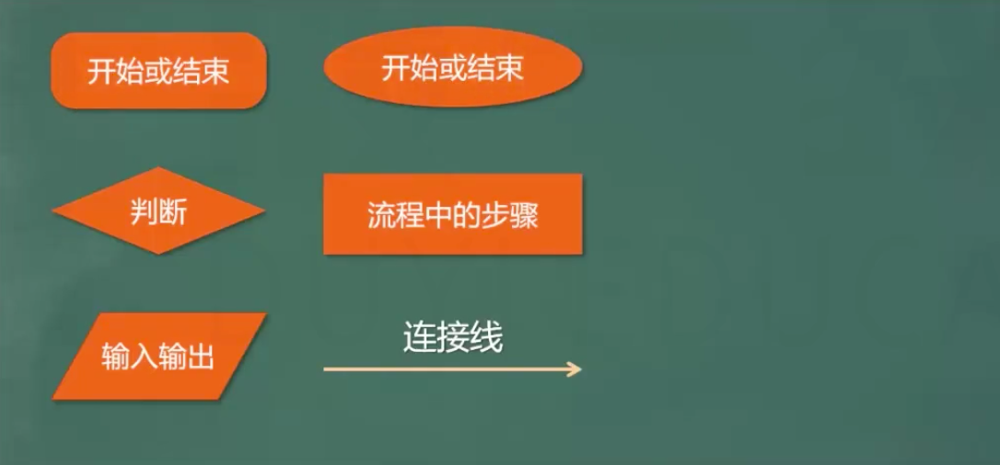
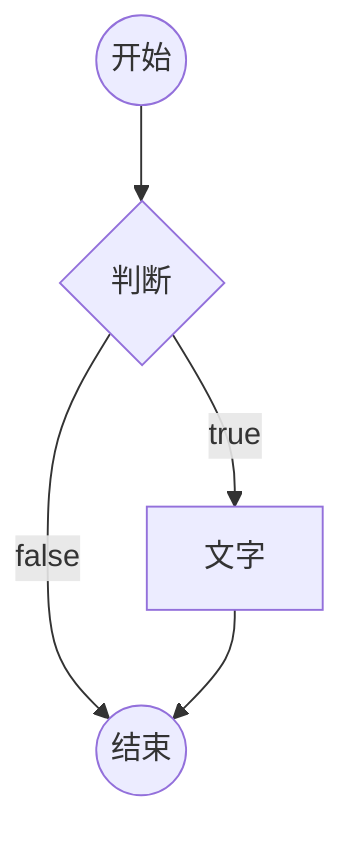
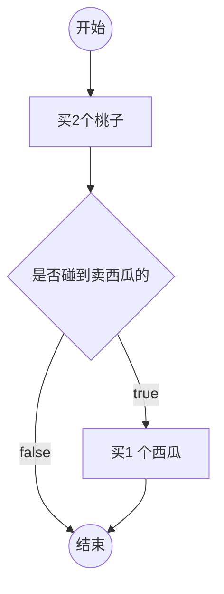
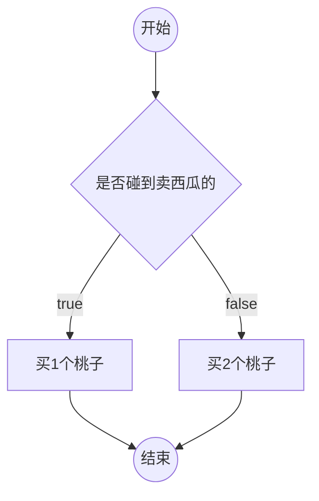

# 流程图

一套标准的图形，用于描述程序的逻辑

通常流程图分析程序的流程

## 在markdown中画流程图

```mermaid
graph TD
start((开始))-->if{判断}
if--true-->A[文字]
if--false-->ed((结束))
A-->ed
```
## 例子
示例1:

```mermaid
graph TD
st((开始))--> buyPeach[买2个桃子]
buyPeach-->if{是否碰到卖西瓜的}
if--true-->buyXigua[买1 个西瓜]
if--false-->ed((结束))
buyXigua-->ed
```

示例2:

```mermaid
graph TD
st((开始))-->if{是否碰到卖西瓜的}
if--true-->买1个桃子
if--false-->买2个桃子
买1个桃子-->ed((结束))
买2个桃子-->ed
```
