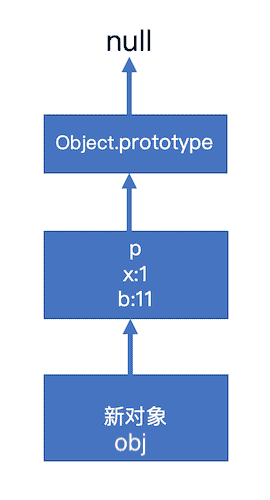

# 原型链的应用

## 基础方法

W3C 不推荐直接使用系统成员`__proto__`

- **`Object.getPrototypeOf(对象)`**：

  获取对象的隐式原型。--静态成员

  ```js
  var obj = {}
  Object.getPrototypeOf(obj) // 获取 obj 的隐式原型

  Object.getPrototypeOf(obj) === obj.__proto__ // true
  ```

- **`Object.prototype.isPrototypeOf(对象)`**

  判断当前对象(this)是否在指定对象的原型链上。--实例成员

  ```js
  function A() {}
  var obj = new A()
  var o = {}

  Object.prototype.isPrototypeOf(obj) // true
  // 判断 Object.prototype 在不在 obj 的原型链上

  Function.prototype.isPrototypeOf(obj) // false
  // 判断 Function.prototype 在不在 obj 的原型链上

  o.isPrototypeOf(obj) // false
  // 判断 o 在不在 obj 的原型链上

  Object.getPrototypeOf(o).isPrototypeOf(obj) // true
  // 判断 Object.getPrototypeOf(o) 在不在 obj 的原型链上
  // Object.getPrototypeOf(o) 得到的是 o 的隐式原型 --> Object.prototype

  Array.prototype.isPrototypeOf(document.getElementsByTagName('a')) // false
  // 判断 Array.prototype（数组的原型） 在不在 document.getElementsByTagName('a') 的原型链上
  // 可以 判断 document.getElementsByTagName('a') 是不是一个真数组，等同于下面的写法：

  Array.isArray(document.getElementsByTagName('a'))
  ```

* **`实例对象 instanceof 构造函数`**

  判断构造函数的原型 是否在 实例对象的原型链上。读作：某个实例对象 是不是某个 构造函数。

  ```js
  var obj = {}
  obj instanceof Object // true
  // obj 是不是一个 对象

  [] instanceof Array // true
  // [] 是不是一个 数组
  ```

* **`Object.create(对象)`**

  创建一个新对象，将其隐式原型指向指定的对象。-- 静态成员。

  ```js
  var p = { a: 1, b: 11 }
  var obj = Object.create(p) // obj 的 隐式原型指向 p

  var obj2 = Object.create(null) // obj2 隐式原型 为 null
  ```

  隐式原型图示：

  

* **`Object.prototype.hasOwnProperty(属性名)`**

  判断一个对象**自身**是否拥有某个属性。-- 实例成员。

  ```js
  var p = { a: 1, b: 11 }
  var obj = Object.create(p)

  obj.hasOwnProperty('a') // false
  ```

::: tip 注意
使用 `for in`，循环对象属性时，只循环该对象本身的属性，可使用 `hasOwnProperty()`作为判断。
:::

示例：

```js
var p = {
  a: 111,
  b: 222,
}
var obj = Object.create(p) // 将 obj 的隐式原型指向 p
obj.c = '333' // 给 obj 添加一个属性 c

for (var prop in obj) {
  if (obj.hasOwnProperty(prop)) {
    console.log(prop) // c ；只循环到自身的属性 c
  }
}
```

## 应用

### 类数组转换为真数组

```js
Array.prototype.slice.call(类数组)
```

### 实现继承

默认情况下，所有构造函数的父类都是 Object。

```js
function User(firstName, lastName, age) {
  this.firstName = firstName
  this.lastName = lastName
  this.age = age
  this.fullName = this.firstName + ' ' + this.lastName
}

User.prototype.sayhello = function() {
  console.log(`大家好，我叫${this.fullName}，今年${this.age}岁了。`)
}

function VIPUser(firstName, lastName, age, money) {
  User.call(this, firstName, lastName, age)
  this.money = money
}

// 调用继承函数
inherit(VIPUser, User)

// 继承函数，帮助调整继承关系
function inherit(son, father) {
  // 通过 Object.create() 创建一个新对象，并将其原型指定为父类的原型 father.prototype；
  // 然后赋值给子类的原型
  son.prototype = Object.create(father.prototype)

  // 由于创建的新对象没有 constructor ，所以子类的原型上也没有；
  // 将 子类本身 赋值给 子类的原型中的 constructor 
  son.prototype.constructor = son

  // 在子类的原型上添加一个属性 uber，并将父类的原型赋值给 uber。
  son.prototype.uber = father.prototype
}

VIPUser.prototype.upgrade = function() {
  console.log(`使用了${100}软妹币，升级了！`)
  this.money -= 100
}

var vUser = new VIPUser('小', '明', 3, 100)
```
